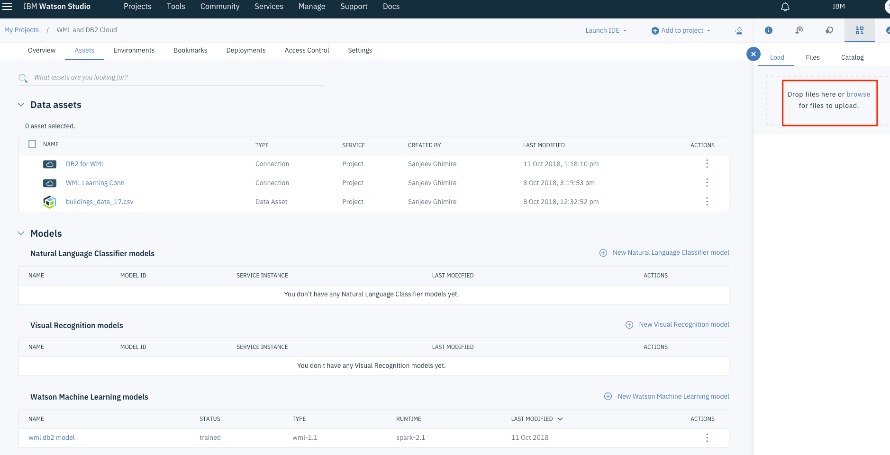
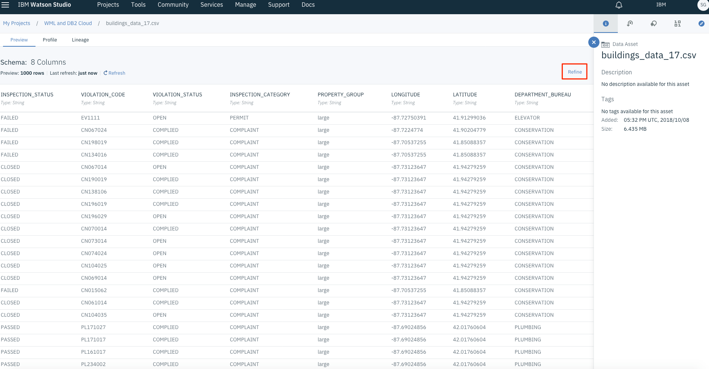
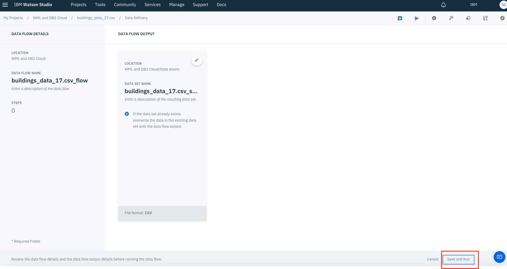
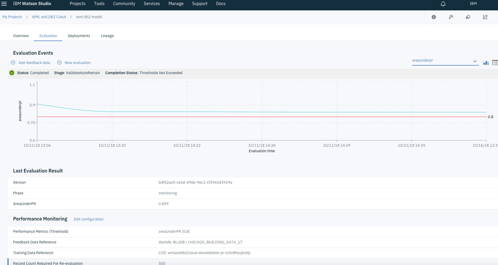

# Continuous Learning with Watson Machine Learning and IBM Db2 Warehouse on Cloud

In this code pattern, we will use IBM Watson Machine Learning and Watson Studio &mdash; which allows data scientists and analysts to quickly build and prototype models &mdash; to monitor deployments, and to learn over time as more data becomes available. Performance Monitoring and Continuous Learning enables machine learning models to re-train on new data supplied by the user or other data sources. All applications and analysis tools that depend on the model are automatically updated as Watson Studio handles the selection and deployment of the best model.

In this code pattern, we’ll solve a problem for the City of Chicago using the Model Builder to model building violations. We’ll predict which buildings are most likely to fail an inspection, and we'll intelligently rank buildings by their likelihood to fail an inspection, saving time and resources for the city and building inspectors. We’ll begin by building a model on publicly available data from 2017, starting in September. Then, we will introduce data from October, November, and December data to simulate learning and model re-training over time.

When the reader has completed this Code Pattern, they will understand how to:
* Use Watson Studio to create a project and associate services
* Use IBM Machine learning service to take advantage of machine learning models management (continuous learning system) and deployment (online, batch, streaming)
* Use Apache Spark-as-a-service cluster computing framework optimized for extremely fast and large scale data processing.
* Create and deploy self learning Watson Machine learning models

## Flow


1. Initial source data is loaded into an IBM Db2 Warehouse on Cloud database.
2. The source data is then loaded, as data asset, into Watson Studio.
3. The Watson Machine Learning service uses the source data and computes an evaluation using Apache Spark-as-a-service to create a machine learning model, and saves the evaluation information back to the Db2 Warehouse on Cloud database.
4. Apache Spark-as-a-service to compute the evaluation.
5. Feedback data is uploaded to Watson machine learning service to continuously learn and evaluate the new data.
6. Once the evaluation is done the Watson Machine Learning service creates a machine learning model.
7. The model data is exposed through an API.
8. Applications can use the API to evaluate new data and create a new model based on continuous learning.


## Included components

* [Watson Machine Learning](https://www.ibm.com/cloud/machine-learning): Use trusted data to put machine learning and deep learning models into production. Leverage an automated, collaborative workflow to grow intelligent business applications easily and with more confidencelaborate on building conversational AI solution.
* [Apache Spark](https://www.ibm.com/cloud/spark): Apache Spark is an open source cluster computing framework optimized for extremely fast and large scale data processing, which you can access via the newly integrated notebook interface IBM Analytics for Apache Spark.
* [IBM Db2 Warehouse on Cloud](https://www.ibm.com/cloud/db2-warehouse-on-cloud): IBM Db2 Warehouse on Cloud is an elastic, fully managed cloud data warehouse service that's powered by IBM BLU Acceleration® technology for increased performance and optimization of analytics at a massive scale.
* [Watson Studio](https://www.ibm.com/cloud/watson-studio): IBM Watson Studio provides tools for data scientists, application developers and subject matter experts to collaboratively and easily work with data to build and train models at scale. It gives you the flexibility to build models where your data resides and deploy anywhere in a hybrid environment so you can operationalize data science faster.

## Featured technologies

* [Artificial Intelligence](https://medium.com/ibm-data-science-experience): Artificial intelligence can be applied to disparate solution spaces to deliver disruptive technologies.
* [Machine Learning](https://en.wikipedia.org/wiki/Machine_learning): Machine learning is a field of artificial intelligence that uses statistical techniques to give computer systems the ability to "learn" (e.g., progressively improve performance on a specific task) from data, without being explicitly programmed
* [IBM Db2 Warehouse on Cloud](https://www.ibm.com/cloud/db2-warehouse-on-cloud): IBM Db2 Warehouse on Cloud is an elastic, fully managed cloud data warehouse service that's powered by IBM BLU Acceleration technology for increased performance and optimization of analytics at a massive scale.
* [Continuous Learning](https://en.wikipedia.org/wiki/Incremental_learning): Continuous learning is a method of machine learning, in which input data is continuously used to extend the existing model's knowledge i.e. to further train the model.

# Watch the Video

[](https://www.youtube.com/watch?v=HCVxGMd1RiQ)


# Steps

The setup is done in 3 primary steps.  You will download the code, setup the application and then deploy the code to IBM Cloud.  If you would like to run the code locally, there will be one more step to configure the credentials locally.

1. [Clone the repo](#1-clone-the-repo)
2. [Create Watson Studio Project](#2-create-watson-studio-project)
3. [Add and Refine data asset into Watson Studio](#3-add-and-refine-data-asset-into-watson-studio)
4. [Create a Db2 Warehouse on Cloud database and add the connection to Watson Studio](#4-create-db2-warehouse-on-cloud-and-add-the-connection-to-watson-studio)
5. [Create Apache Spark as a service with IBM Cloud](#5-create-apache-spark-as-a-service-with-ibm-cloud)
6. [Create Watson Machine Learning with IBM Cloud](#6-create-watson-machine-learning-with-ibm-cloud)
7. [Add new Watson Machine Learning Model to Watson Studio](#7-add-new-watson-machine-learning-model-to-watson-studio)
8. [Add Feedback data and new evaluations to the continuously learning model](#8-add-feedback-data-and-new-evaluations-to-the-continuously-learning-model)
9. [Deploy the model to expose it through an API](#9-deploy-the-model-to-expose-it-through-an-api)
10. [Test the model](#10-test-the-model)


### 1. Clone the repo

Clone the `continuous-learning-with-watson-ml-and-db2` locally. In a terminal, run:

```
$ git clone https://github.com/IBM/continuous-learning-with-watson-ml-and-db2
$ cd continuous-learning-with-watson-ml-and-db2
```

### 2. Create Watson Studio Project

If you do not already have an IBM Cloud account, [sign up for IBM Cloud](https://console.bluemix.net/registration) and login to your IBM cloud account.

First you will need to create an `Object Storage` service if you don't already have one. From the catalog, search for `object storage`, select `Object Storage` service, choose the `lite` plan and click `create`.


Go back to catalog, search for `Watson Studio`, select it, choose the `lite` plan and click `create`.


Create a new Project by clicking the `New Project` link, choose `Complete`, give it a name and click create.


### 3. Add and Refine data asset into Watson Studio

In Watson Studio, go to your project and select the `Assets` tab. From the right navigation panel, click `Browse` to upload your source data that will be used by the machine learning service to create a machine learning model.



Select the uploaded data file (`.csv`). At the top right, click `Refine`. We don't need to manipulate the data, so simply click the "run" button labeled with a ▶ icon at the top right. The data flow output will show that you're creating a CSV file, which will be saved into your object storage bucket. Click `Save and Run`.





### 4. Create a DB2 Warehouse on Cloud database and add the connection to Watson Studio

From the IBM Cloud catalog search for `DB2 Warehouse on Cloud` and create one using the appropriate plan.


Once the service is created, create new credentials by selecting `Service Credentials` option in the left navigation panel. Make sure to save the credentials for upcoming steps.


From Watson Studio project that you have created earlier, go to `+ Add to Project` and choose `Connection` 


Select `Db2 Warehouse` from the available options to connect to Db2 warehouse you created earlier.


Configure the connection based on the DB2 credentials you saved earlier.


### 5. Create Apache Spark as a service with IBM Cloud

From the catalog in IBM Cloud, search for keyword `spark` and choose `Apache Spark` service.


Create the service using `lite` plan.


Once created, we need to add this service to Watson Studio. Go to your  Watson studio project, select `settings` and from the `+ Add Service` dropdown list, select `spark` and add the existing spark service that you have just created.


### 6. Create Watson Machine Learning with IBM Cloud
From the catalog in IBM Cloud, search for keyword `machine learning` and choose `IBM Machine Learning` service.


Create the service using `lite` plan.


Similar to the previous Step 5, Add the machine learning service you just created to your Watson Studio project.

### 7. Add new Watson Machine Learning Model to Watson Studio

From the `Assets` tab of your Watson Studio project, select `+ New Watson Machine Learning Model`


Provide a name, choose the `Machine Learning` and `Apache Spark` instance that you added to your project, choose `Model Builder` for model typ, choose `Manual` so that you can prepare your own data and click `Create`.


Select the `data asset` (in our case its a .csv file)


Once the data is loaded, choose the `INSPECTION_STATUS` as the column to predict for new set of data and `All` for feature columns. We will be using `Binary Classification`. Add Estiimators by clicking the `+ Add Estimators` link, and in our case we will be using `Logistic Regression` and `Decision Tree Classifier`. You can select others as well based on what kind of estimator algorithm you want to choose.


Once the training and evaluation is done, you can choose the one that performed the best and then click `Save`.


### 8. Add Feedback data and new evaluations to the continuously learning model

Once the Watson Machine Learning Model is saved, select the `Evaluation` tab. First we need to configure the performance monitoring. 

* Select the `Configure Performance Monitoring` link

* Add the spark service to your watson studio project
* Choose `areaUnderPR` (performance metric of the model) and select the threshold as 0.8. This means if the performance is under 0.8, the model needs to be re-trained using all the source data and new data and hence continuous learning.
* Use `500` as record count and click `Save`.
* Add the connection by selecting `Select Feedback Reference Data` and select the DB2 connection that you previously created.


* Once thats done, now you can add data using `+ Feedback Data`


* Once the feedback data is loaded, select `New Evaluation` to evaluate the uploaded feedback data. You can unzip the provided data [Chicago building inspection data by month 2017](building_inspection_data_by_month_2017.zip) in the repo and use that monthly inspection data as feedback data.


* When the evaluation is completed we can see where the threshold value lies for this new feedback data.


* You can also see the list of evaluations that have been completed and see how the model has been continuously learning

* You can upload new feedback data repeatedly from the provided data [Chicago building inspection data by month 2017](building_inspection_data_by_month_2017.zip) so that the model continuously learns.

### 9. Deploy the model to expose it through an API

* Select the model, and then select `Deployments` tab. Click `+ Add Deployment` to add a new deployment,

* Provide a name and choose `Web Service` as deployment type.

* Now the model is exposed through and API. If you select `Impelementation` tab you can see differnt examples on how to use the newly created API.


### 10. Test the model

You can access and test the API programmatically, or use curl commands. You can also go to the `Test` tab and provide a new set of data to evaluate the inspection status.


The result of the evaluation is shown in a horizontal graph located on the right side of the page.


## Troubleshooting

If the evaluation gives an error as shown below, you need to upgrade the `Machine Learning` service instance to the `Standard`.


## Links

* [IBM Watson Studio](https://dataplatform.cloud.ibm.com/docs/content/getting-started/welcome-main.html) documentation
* [IBM Secure Gateway](https://console.bluemix.net/docs/services/SecureGateway/index.html) documentation
* [Docker](https://docs.docker.com/) documentation
* [Db2 Warehouse on Cloud](https://www.ibm.com/support/knowledgecenter/en/SS6NHC/com.ibm.swg.im.dashdb.kc.doc/welcome.html) documentation
* Related code pattern: [Continuous learning on Db2](https://github.com/IBM/watson-continuous-learning-on-db2)
* Related video: [Continuous Learning on Watson Data Platform](https://www.youtube.com/watch?v=HCVxGMd1RiQ)

## Learn more

* **Artificial Intelligence Code Patterns**: Enjoyed this Code Pattern? Check out our other [AI Code Patterns](https://developer.ibm.com/code/technologies/artificial-intelligence/).
* **AI and Data Code Pattern Playlist**: Bookmark our [playlist](https://www.youtube.com/playlist?list=PLzUbsvIyrNfknNewObx5N7uGZ5FKH0Fde) with all of our Code Pattern videos
* **With Watson**: Want to take your Watson app to the next level? Looking to utilize Watson Brand assets? [Join the With Watson program](https://www.ibm.com/watson/with-watson/) to leverage exclusive brand, marketing, and tech resources to amplify and accelerate your Watson embedded commercial solution.

## License

[Apache 2.0](LICENSE)


